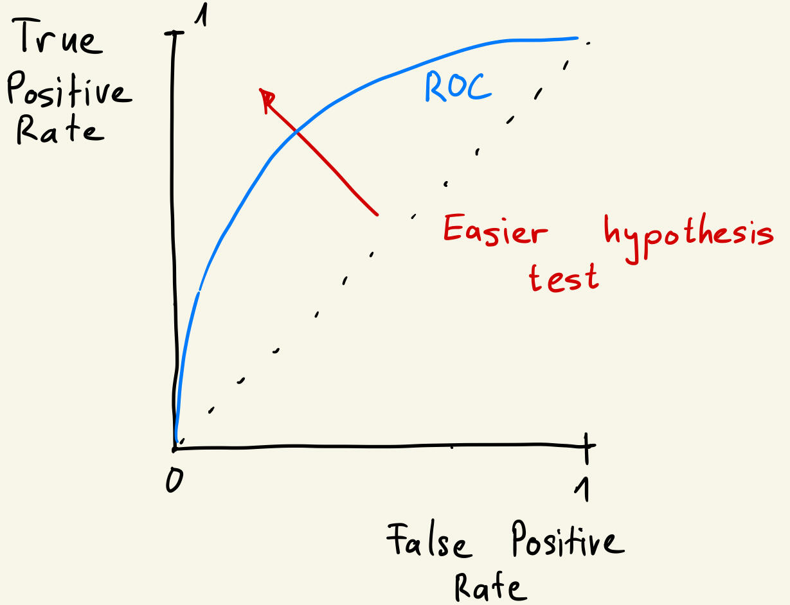
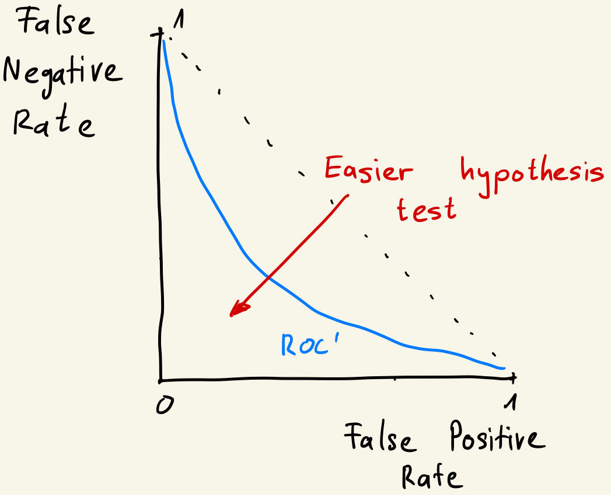
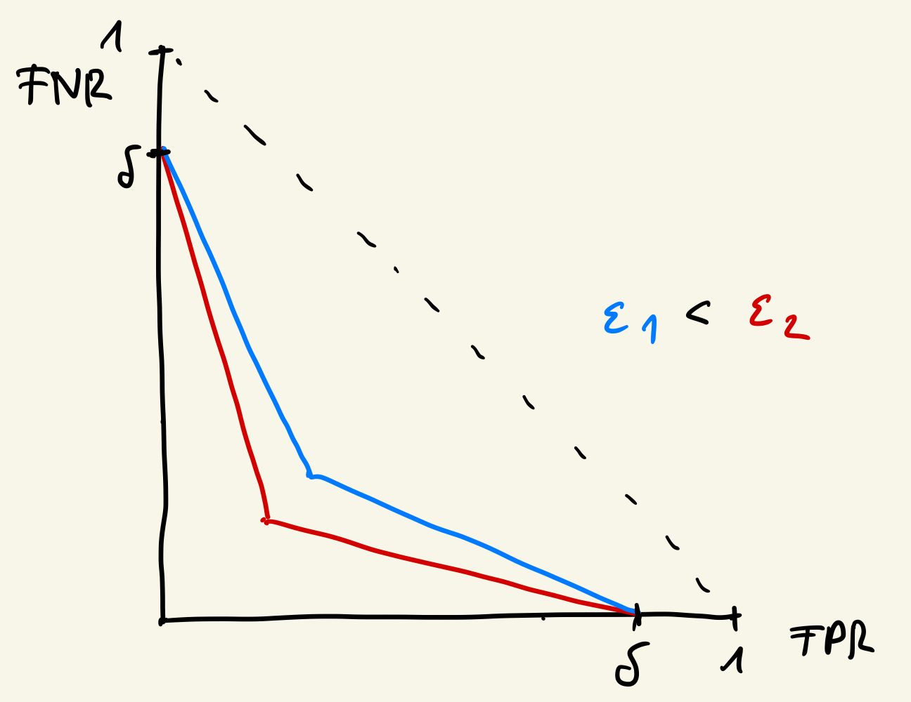

>This post was also published on the eScience Center blog.

This post is the second in a series on evaluating privacy in machine learning models (see first episode [here](../ml-privacy-eval-1/). It explains the hypothesis testing interpretation of differential privacy by showing how differential privacy constrains the success of any attacker in finding out about the underlying data.

The post assumes readers are familiar with differential privacy and some concepts in statistics and machine learning. In addition, it keeps concepts such as an “input database” and a “data release” abstract. If you are unfamiliar with either of these terms, you can have a look at the [previous post](../ml-privacy-eval-1/). It introduces differential privacy and has a specific example for an input database and a data release.

## Differential privacy through the lens of hypothesis testing

The [first](../ml-privacy-eval-1/) blog post of this series showed that differential privacy has adversarial thinking built-in: Leaking sensitive information may allow a malevolent actor to use the information to the disadvantage of a person in the database. In a differentially private mechanism, the more noise is added, the less any adversary can learn about any particular record in the database.

### Adversarial inference as a hypothesis test

This intuition was formalized by [Wasserman & Zou (2009)](https://arxiv.org/abs/0811.2501). Imagine an adversary has access to a differentially private data release `Y` from a tabular database `db`. And suppose the adversary wants to find out if a particular person i was part of the database `db`. Define the neighboring databases `db0` and `db1`, where `i` is only in `db1` but not in `db0`.

Then, the adversary faces the following hypothesis testing problem:

- H0: `Y` was drawn from `db0`, so that `i` was not in the input data for `Y`.
- H1: `Y` was drawn from `db1`, so that `i` was in the input data for `Y`.

When seeing the data, the adversary needs to make an inference about the true state of `db`, having seen only `Y`.

There are four possible scenarios.

- The adversary correctly predicts that `Y` was based on `db0`. This is a true negative.
- The adversary correctly predicts that `Y` was based on `db1`. This is a true positive.
- The adversary predicts that `Y` was based on db0, but in truth it was based on `db1`. This is a false negative.
- The adversary predicts that `Y` was based on db1, but in truth it was based on `db0`. This is a false positive.

### Deriving the ROC curve

How does the adversary make their inference? They need a decision rule that takes the observed data `Y` and returns an output that is `db0` or `db1`.

In a future blog post, we will be more specific on what such a rule can look like and how one can derive it. For now, we assume the adversary has the following decision rule: First, they have a trained logistic regression model that takes `Y` as input and returns a score. Second, the adversary decides on a threshold: if the score is above the threshold, the decision rule returns `db1`, and `db0` otherwise.

In other words, the adversary rejects `H0` in favor of `H1` if the score is above the threshold. Then, lowering the threshold means rejecting `H0` more often, and so:

- The adversary is more likely to detect cases when `Y` is based on `db1`. This means a higher true positive rate, which is good for the adversary.
- But the adversary is also more likely to predict that `Y` is based on `db1` when in truth it is based on `db0`. This means a higher false positive rate, which is bad for the adversary.

We can visualize this trade-off with the [Receiver Operating Characteristic curve](https://en.wikipedia.org/wiki/Receiver_operating_characteristic), or ROC curve:

*Figure 1: The blue line is an ROC curve. The distinguishing between H0 and H1 becomes easier as the True Positive Rate increases and the False Positive Rate decreases, thus moving North-West n the figure.*

In the figure above, the blue line defines the trade-off between the False Positive Rate `FPR` and the True Positive Rate `TPR` for a given prediction model. Lowering the `FPR` comes at the cost of a lower `TPR`, and vice-versa.

Moreover, the red arrow indicates the direction in which it becomes easier to distinguish between H0 and H1, meaning a lower `FPR` and a higher `TPR`: An ideal decision rule gives an `FPR` of 0 and a `TPR` of 1. On the other hand, the dotted line indicates the performance of a decision rule that randomly rejects or does not reject H0.

The ROC curve is a standard tool in machine learning for classification---and from here it is only a few steps to visualizing how differential privacy restricts the amount of information an adversary can learn from a data release.

### Flipping the ROC curve

To start, let’s flip the y-axis in the above figure, and recognize that `1-TPR` is the False Negative Rate `FNR`. Thus, we have a curve in the `FPR-FNR` space:

*Figure 2: The blue line is an ROC’ curve, which is the ROC curve with a flipped y-axis. The hypothesis test gets easier as we move South-West.*

This figure shows the same information as the previous figure. Importantly, the hypothesis test is easier the closer the blue `ROC` curve follows the two axes---in other words, the more convex the curve is.

### Differential privacy puts constraints on the best possible ROC curve

Next, [Kairouz et al (2015)](https://arxiv.org/abs/1311.0776) show that if an algorithm satisfies `(epsilon, delta)` differential privacy, then the adversary’s success in the hypothesis testing problem is bounded by a function of `epsilon` and `delta`. Specifically, this bound can be drawn in the `FPR-FNR` space as follows:

*Figure 3: The performance boundaries of a hypothesis test for two differentially private mechanisms: The blue is from a mechanism that is `(epsilon1, delta)` differentially private. The red is from a mechanism that is `(epsilon2, delta)` differentially private. The latter allows for a more convex ROC’ curve of the adversary, and therefore provides less privacy than the first mechanism.*

First, the blue line indicates the best possible performance any adversary can achieve in the hypothesis testing problem when the data satisfy `(epsilon1, delta)` differential privacy. This means the `ROC'` curve from the previous figure, needs to stay above the blue line---for any adversarial decision rule. As before, the dotted line shows the performance of a decision rule that is completely random.

Second, the figure illustrates that the parameter `delta` defines the intercepts of the line on both the `FPR` and `FNR` axes. Intuitively, `delta` defines an area where the adversary’s trade-off is not bounded---for instance, they can lower the `FNR` without increasing the `FPR`.

Lastly, the figure illustrates howepsilon defines the slope of the constraint. Consider two mechanisms with equal `delta`, but varying epsilonparameters---denoted `epsilon1` and `epsilon2` with `epsilon1 < epsilon2`. Then, we see that the constraint for `epsilon2` is closer to the origin of the diagram---showing that a higher epsilon means lower privacy and an easier business for an adversary to make inferences about the underlying data.

## What do we learn?
Starting from the ROC curve in machine learning, we saw how differential privacy restricts the success of an adversary trying to infer whether a certain record was part of a differentially private data release.

In the next post, we will see how these insights lead to the notions of functional and Gaussian differential privacy, which are more handy to work with for certain analyses of privacy.

>Thanks to Kody Moodley, Erik Tjong Kim Sang and Lourens Veen for commenting on and discussing an earlier draft.

