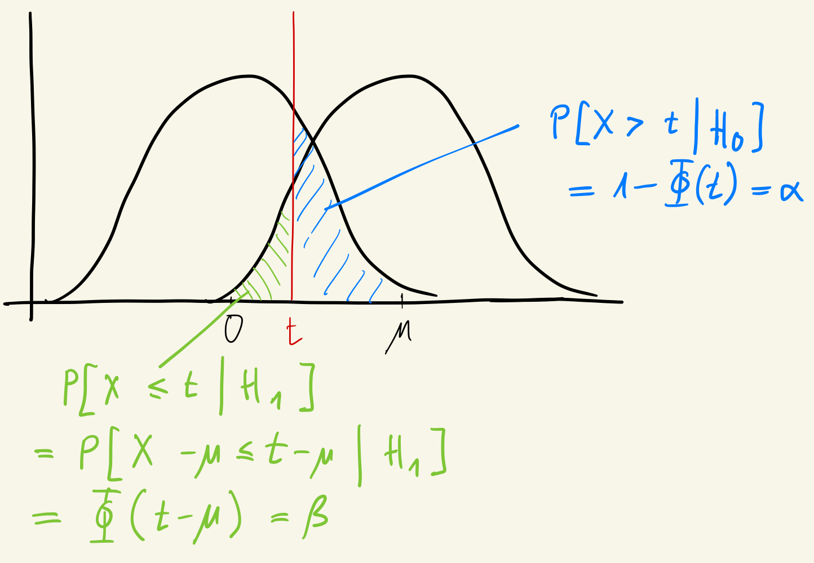

>This post was also published on the eScience Center blog.

This post is the third in a series on differential privacy and machine learning (see here episodes [I](../ml-privacy-eval-1) and [II](../ml-privacy-eval-2)). It takes a big step towards understanding how to assess privacy properties of machine learning algorithms: It introduces functional and gaussian differential privacy as defined by [Dong et al. (2022)](https://academic.oup.com/jrsssb/article/84/1/3/7056089). This definition helps reasoning about differential privacy in some contexts, and in particular it has been useful for recent work in auditing machine learning algorithms with differential privacy.

When reading this post, the reader should be familiar with [the previous post](../ml-privacy-eval-2) in this series. That post showed that differential privacy constrains the success of an attacker in inferring whether a particular record was included in a differentially private data release.

## Functional Differential Privacy

### Trade-off functions

So far, we have derived the boundary for the best possible performance of any adversary in the original case of `(epsilon,delta)` differential privacy. It turns out this function is an instance of what Dong et al. (2022) define as a trade-off function.

Remember that a differentially private mechanism `M` induces two different distributions of data under the two competing hypotheses H0 and H1. A trade-off function `T(P,Q)(alpha)` defines the difficulty in distinguishing the two distributions: it is defined over any two probability distributions `P` and `Q`, and tells us the lowest achievable type-II error rate `beta` (= False Negative Rate `FNR`) an adversary can achieve with a type-I error rate (= False Positive Rate `FPR`) of at most `alpha`. The higher this function, the higher the lowest achievable type-II error rate for any `alpha`, thus the harder it is to distinguish the two distributions `P` and `Q`.

As a concrete example, a trade-off function `TP(P,Q)(0.05)=0.1` tells us that distinguishing `P` from `Q` with a type-I error of at most 0.05 cannot have a type-II error of less than 0.1.

A trade-off function has the following mathematical properties:

- It takes inputs `alpha` that range from 0 to 1.
- It has domain `beta` that range from 0 to 1.
- It is convex, continuous, non-increasing.
- For all `alpha`, `beta` lies on or below the line `1-alpha`. The dotted line in figure 2 of the [previous blog post](../ml-privacy-eval-2) represents the line `1-alpha`, indicating that the distributions `P` and `Q` are indistinguishable.

### Functional Differential Privacy

Instead with parameters `(epsilon, delta)`, it is now possible to define differential privacy in terms of a function---and is thus called functional differential privacy.

According to the definition, a mechanism `M` is `f`-differentially private if it creates, for all neighboring databases `db0` and `db1`, a trade-off function over `M(db0)` and `M(db1)` that is bounded by the trade-off function `f`.

The definition is best illustrated with this figure from Dong et al (2022):

*Figure 1: Functional differential privacy. The solid line is a trade-off function for `f`-differential privacy. Only the dashed line above the solid line satisfies `f`-differential privacy. Source: Dong et al (2022).*

The figure has the same x- and y-axes as the figures in the previous blog post: On the x-axis is the false positive rate, or type I error; on the y-axis is the false negative rate, or type II error.

The solid line is the trade-off function `f`. The other lines represent trade-off functions from differentially private mechanisms. Among them, only the dashed line that never crosses the solid line is `f`-DP; the other lines do not always lie above the line defined by `f`, and thus do not satisfy `f`-differential privacy. For reference, the kinked line could have come from an `(epsilon, delta)`-differentially private mechanism we discussed in the previous post.

### Analyzing composition

A first advantage of functional differential privacy is that it makes it easier to analyze properties such as composition. Composition handles the question of how sequentially querying a dataset with a private mechanism impacts the overall privacy of the original dataset, after all queries are applied. As an example, take an analyst that sequentially queries a private dataset: they query the data with a private mechanism, explore the result, and query the data in a way that depends on the result of the first query. The question arises: how does this sequential and adaptive querying of the data degrade overall privacy? If the person is adversarial, they may try to refine the queries step by step until they found the answer to their question.

A key result in Dong et al (2022) is that the `n`-fold composition of mechanisms that are `f_i` differentially private is `f*`-differentially private. The precise level of privacy `f*` depends on the privacy of each individual mechanism `f_i`, and details can be found in section 3 of the paper. Importantly, this privacy bound is *tight*: `f*` is the most precise bound possible, informally meaning that we cannot move the function `f*` further away from the x-y origin without making the `f*` function crossing the trade-off function of the composed mechanism.

This contrasts with `(epsilon,delta)`-differential privacy, where composition cannot be bounded as tightly.

## Gaussian differential privacy

A special case of `f`-differential privacy is Gaussian differential privacy. In this definition, the trade-off function is defined over two unit-variance normal distributions---one with mean 0, the other with mean `mu`. In other words, under H0, the private mechanism generates a standard normal distribution, and under H1, it generates a normal distribution with mean `mu` and variance 1. This is shown in the following figure:

*Figure 2: Two normal distributions. Under H0, `X` is generated with mean 0 and standard deviation 1. Under H1, `X` is generated with mean `mu` and standard deviation 1.*

While this definition makes assumptions about the functional form of the distribution, it is very useful:

1. It summarizes the adversary’s trade-off between false positives and false negatives with a single parameter, `mu`. This makes it easy to describe and interpret privacy guarantees.
2. It characterizes the Gaussian mechanism, one commonly used differentially private mechanism.
3. As shown by Dong et al (2022), Gaussian differential privacy is the asymptotic limit when `f`-differentially private mechanisms are applied repeatedly on the same dataset. This is useful for analyzing complex algorithms that consist of multiple, adaptive and individually private steps.

### Relation to machine learning

It is this last result that has made Gaussian differential privacy an important tool for analyzing differentially private machine learning.

While we discuss it in detail in a future blog post, a commonly-used algorithm in deep learning is Differentially Private Stochastic Gradient Descent (DP-SGD). It is a method for sequentially updating parameters in a complex neural network: Instead of directly updating parameters with the gradients in each batch, noise is added and the contribution of individual samples in the batch is constrained. This avoids that any individual sample contributes too much to the parameter update, and can be shown to satisfy differential privacy.

Since each parameter update is differentially private, one can view the trained model that results after many iterations as an algorithm that composes multiple differentially-private queries on the training data. Therefore, one can use Gaussian differential privacy to derive tight privacy bounds of the DP-SGD algorithm, which was not possible before.

### Trade-off function for Gaussian differential privacy

Building on the previous figure, the following figure illustrates the trade-off between false positives and false negatives under Gaussian differential privacy.

*Figure 3: The likelihood-ratio test with normal distributions. If `X` is higher than t, H0 is rejected in favor of H1, and vice-versa. The blue and green areas show the false positive and false negative rates, respectively.*

The red line indicates a decision threshold. In particular, when conducting a hypothesis test, the [Neyman-Pearson lemma](https://en.wikipedia.org/wiki/Neyman%E2%80%93Pearson_lemma) says that the best test statistic is the likelihood ratio test: Given a sample `X`, the likelihood ratio test compares the likelihood that the sample was generated under H1 vs H0. From the figure above, we see that because the likelihood ratio of H1 vs H0 is increasing in `X`, the null hypothesis is rejected if `X` is above some threshold `t`, indicated in red.

Given the decision threshold, we can derive the False Positive and the False Negative rates:

1. The False Positive Rate is defined for cases when H0 is falsely rejected. This happens if `X>t` but `X` was generated under H0. This probability is shown by the blue area.
2. The False Negative Rate is defined for cases when H0 is falsely not rejected. This happens if `X<t` but X was generated under H1. This probability is shown by the green area.

Now that we have an analytical expression for both `FPR` and `FNR`, we can derive the trade-off function---the `FNR` as a function of the `FPR` and `mu`: We rearrange the equation for the `FPR` for `t` and then plug in `t` to the equation for `FNR`. This yields the following trade-off function:

$$G_{\mu}(\alpha) = \beta(\alpha) = \Phi(\Phi^{-1}(1-\alpha)-\mu)$$

Again, an illustration makes this easier to understand:

*Figure 4: The trade-off function for Gaussian differential privacy. $\Phi$ is the standard normal distribution. $\alpha$ is the false positive rate, $\beta$ is the false negative rate. A lower $\mu$ means more privacy.*

First, for a given false positive rate `alpha`, the false negative rate is at least as large as the the green area. In line with the definition of a trade-off function, lowering the false positive rate makes the red area smaller, and pulls the boundary of the green area to the right, thus increasing the false negative rate.

Second, a lower `mu` is associated with more privacy: as `mu` decreases, it pulls the boundaries of the false positive or the false negative rate closer to the center, thereby making it harder to distinguish between the distributions generated by H0 and H1.

Dong et al (2022) also illustrate the trade-off function for some values of mu:

*Figure 5: Example trade-off functions for different values of $\mu$. Source: Dong et al (2022).*

Here, for instance `G_{0.5}` is the trade-off function for Gaussian differential privacy with `mu=0.5`. Reasonable privacy is given for `mu=0.5`, whereas for `mu=6` the trade-off function almost coincides with the x- and y-axis, thus giving virtually no privacy.

### Connections between definitions of privacy

A last insight from Dong et al (2022) is that one can convert between `(epsilon, delta)`-differential privacy and `f`-differential privacy, and thus also Gaussian differential privacy. This is useful for two reasons. First, it means existing results from `(epsilon, delta)`-differential privacy apply also to the definitions here. Second, for certain analyses, it is more convenient to work with one definition than the other, but results derived from one hold for the other. For instance, one can analyze composition more easily with `f`-differential privacy, but analyze the privacy properties of mechanisms with data sub-sampling (discussed in the paper) more easily with `(epsilon,delta)`-differential privacy.

## Conclusion
We saw that the hypothesis testing interpretation gives rise to new notions of privacy such as `f`- and Gaussian differential privacy, which are more handy to work with for certain analyses of privacy.

We now have the foundations to understand privacy testing in machine learning. Both the hypothesis testing interpretation and Gaussian differential privacy have been useful to empirically check the privacy-preserving properties of machine learning algorithms. This will be covered in a future article.

>Thanks to Kody Moodley, Erik Tjong Kim Sang and Lourens Veen for commenting on and discussing an earlier draft.

