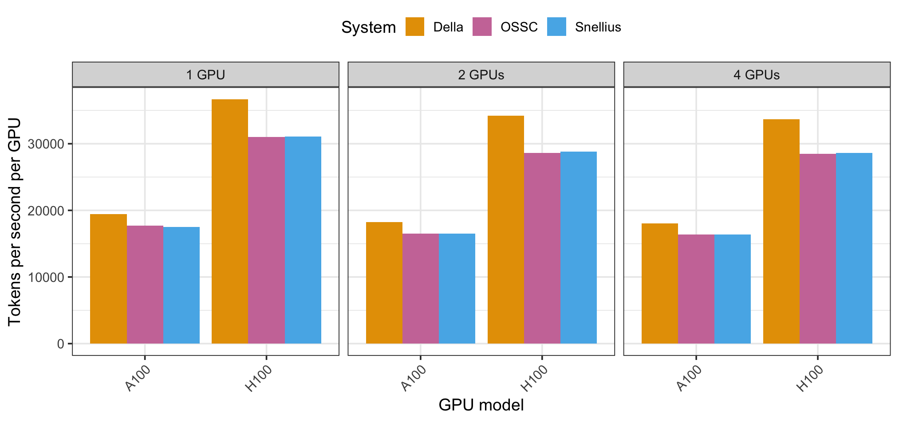

> This post first appeared on the blog of the [Netherlands eScience Center](https://blog.esciencecenter.nl/benchmarking-llm-fine-tuning-on-different-hpc-systems-0ed7efcac646).

## Introduction

We have developed a benchmark that compares the compute performance of fine-tuning LLMs on multiple high-performance computing (HPC) systems, including systems designed for working with sensitive data. In this blog post, we introduce the benchmark, describe the lessons learned developing it and make it [open-source](https://github.com/odissei-benchmarks/torchtune-gpu-benchmark) so that it can be used and improved by others.

### Our use case
Our team researches how Large Language Models (LLMs) can be leveraged to predict social outcomes with large-scale social and survey data. We use the ODISSEI Secure Supercomputer ([OSSC](https://servicedesk.surf.nl/wiki/spaces/WIKI/pages/17826074/ODISSEI+Secure+Supercomputer)), which [SURF](https://www.surf.nl/) operates in the Netherlands. The OSSC is a virtual private cluster running on the hardware of Snellius, the Dutch national supercomputer. The OSSC makes it possible to use GPU and CPU nodes to analyze sensitive data from Statistics Netherlands. This makes the OSSC one among very few systems globally that bring the power of national computing clusters to large-scale social data.

[Previous performance benchmarks for OSSC](https://arxiv.org/pdf/2103.14679) were entirely focused on CPUs, and the performance of OSSC for GPU-intensive tasks, such as fine-tuning LLMs, was unknown.

Our benchmarking compares the performance of the OSSC to two different systems: 1) its parent system, [Snellius](https://www.surf.nl/en/services/snellius-the-national-supercomputer), which is not connected to sensitive data and 2) [Della](https://researchcomputing.princeton.edu/systems/della), an HPC system similar to Snellius, which is operated by Princeton University.

### Beyond our use case

Our benchmark, [openly available on GitHub](https://github.com/odissei-benchmarks/torchtune-gpu-benchmark), is also a starting point for the exploration of fine-tuning performance in other cases. For instance, one can compare the training performance within and across HPC systems:
- Within a system, one may have to choose between different GPU models, and the cost and benefits of using one versus the other may vary depending on the task.
- Across systems, training performance does not only depend on the raw performance of GPUs---the number of floating point operations per second---, but also on factors such as the file system, how the computing hardware (processing cores and nodes) is connected through wires, and the exact version of GPU models used---as we will show.

## The performance benchmark

### The specification
We decided that our benchmark should satisfy the following requirements:
- It is easy to run in many different computing environments.
- It tracks multiple measures of speed, such as tokens per second and wall time.
- It tracks anything useful to understand possible differences between the environments (GPU usage, CPU usage).
- It is fast to run.
- It is easy to improve over time: as our research evolves, we may need to re-assess the performance for new use cases.
- It is easy to understand and replicate.

Our compute conditions are the following:
- Environment: Della, Snellius, OSSC.
- GPUs: A100 (40/80GB VRAM), H100 (80/96GB VRAM).
- Single-node training, with GPUs per node: 1, 2, 4.
- As many CPUs as are necessary to keep the GPUs busy.

### The implementation

We found that [torchtune](https://pytorch.org/torchtune/stable/index.htm) fits our requirements best. We fine-tune the [Llama-3.2–1B-Instruct](https://huggingface.co/meta-llama/Llama-3.2-1B-Instruct) model on the [alpaca-cleaned](https://huggingface.co/datasets/yahma/alpaca-cleaned) dataset. Our main hyperparameters are:
- A context length of 2048 on a packed dataset
- Low-Rank Adaptation (LoRA) for the attention layers as well as the output layers. We use a rank of 64, alpha of 128 and 0 dropout.
- A batch size of 6, which was the maximum we could fit into our least capable GPUs (A100)

## What we found

### Performance differences

The figure below shows the results from our benchmarking runs:

*Tokens per second per GPU on a single node (higher is better). The colors refer to different systems (Della, Snellius, OSSC); the panels refer to different numbers of GPUs.*

In our experience, there was little variation in throughput across different runs on the same system, so we did not average over multiple runs.

Our four key findings are:
- Della was about 15% faster than the Dutch systems, independent of the number and models of GPUs.
- The OSSC performed on par with Snellius.
- For our use case, H100s were between 1.7x and 2x faster than A100s.
- Throughput scales nearly linearly with the number of GPUs: The communication overhead from multiple GPUs was about 6–8% for going from 1 to 2 GPUs and 2% or less for going from 2 to 4 GPUs.

Many of these results made sense to us. Because Della and Snellius are broadly similar systems, we were surprised by the performance gap between the two. Thus, we decided to [investigate further](https://github.com/odissei-benchmarks/torchtune-gpu-benchmark/issues/10).

First, we ruled out that the gap stems from differences in software. The precise way to install dependencies differs between Della and Snellius: Our environments use anaconda on Della and a Python virtual environment with pip on Snellius. We confirmed that the two environments use the same package versions.

Second, we ruled out that the gap stems from differences in the file system. In particular, for high-performance machine learning, data I/O is often a bottleneck, and it can be reduced by using a fast file system. However, our experiments on Snellius showed no difference in speed between the various [file systems](https://servicedesk.surf.nl/wiki/display/WIKI/Snellius+filesystems) available.

We then found that subtle hardware differences probably explain the gap---differences in memory clock speed of the GPUs:

|      | Della    | Snellius |
|------|----------|----------|
| A100 | 1600 MHz | 1215 MHz |
| H100 | 2600 MHz | 1590 MHz |

*Memory clock speed for GPUs on the two systems (higher is better).*

For the A100s, the Snellius/OSSC GPUs have 40GB VRAM, while the Della GPUs have 80GB VRAM. The 80GB variant also comes with a higher memory clock speed than the 40GB variant, leading to the difference in fine-tuning speed on A100s between Della and Snellius.

For the H100s, the difference is in the version of the cards, and specifically their memory: Della has cards with the faster HBM3 memory, while Snellius/OSSC has cards with HBM2e memory. This means that the calculations during model training have a memory speed bottleneck on Snellius/OSSC compared to Della.

### Lessons learned from bringing LLMs into secure computing environments
Running this test and bringing the Llama model into a secure environment created additional challenges.

First, by default, torchtune downloads the specified dataset from the internet without the user noticing. But because the OSSC is cut off from the internet, we had to use the Alpaca dataset locally and adjust the code accordingly before deployment.

Second, to import the model weights to the secure computing environment, we had to ensure that the contents of the files were not a security risk. Thus, we followed current best practices: First, we manually scanned the files with the virus scanner [ClamScan](https://docs.clamav.net/manual/Usage/Scanning.html), similar to what Hugging Face does automatically for models hosted there. Second, we imported the model weights in [safetensors](https://huggingface.co/docs/safetensors/en/index) format, which is safer than the pickle format and prevents arbitrary code execution.

## Conclusion
We introduce a benchmark for comparing throughput for LLM fine-tuning on different HPC systems. We found hardware-driven performance differences between two standard HPC systems. We also provide the first performance comparison of the OSSC compared to its parent system, Snellius. Lastly, our benchmark suggests little cost of scaling fine-tuning to multiple GPUs on a single node.

The code for our benchmark is publicly available: https://github.com/odissei-benchmarks/torchtune-gpu-benchmark

> Thanks to Patrick Bos for feedback on a draft.

---
