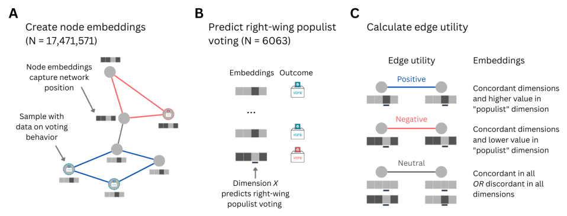

---

##### Download:

- [Paper on arXiv](https://arxiv.org/abs/2508.21236)

---

##### Abstract:

Administrative registry data can be used to construct population-scale networks 
whose ties reflect shared social contexts between persons. With machine learning,
such networks can be encoded into numerical representations -- embeddings -- that
automatically capture individuals' position within the network. We created
embeddings for all persons in the Dutch population from a population-scale network
that represents five shared contexts: neighborhood, work, family, household, and school.
To assess the informativeness of these embeddings, we used them to predict
right-wing populist voting. Embeddings alone predicted right-wing populist
voting above chance-level but performed worse than individual characteristics. 
Combining the best subset of embeddings with individual characteristics only 
slightly improved predictions. After transforming the embeddings to make their
dimensions more sparse and orthogonal, we found that one embedding dimension 
was strongly associated with the outcome. Mapping this dimension back to the
population network revealed differences in network structure related to right-wing
populist voting between different school ties and achieved education levels.
Our study contributes methodologically by demonstrating how population-scale 
network embeddings can be made interpretable, and substantively by linking
structural network differences in education to right-wing populist voting.

---

##### Figure 1: Overview of our pipeline




<!-- ---

##### Citation

Author 1, Author 2. Year. "Title." *Journal* Volume (Issue): First page–Last page. https://doi.org/paper_doi.

```BibTeX
@article{AAYY,
author = {Author 1 and Author 2},
doi = {paper_doi},
journal = {Journal},
number = {Issue},
pages = {XXX--YYY},
title = {Title},
volume = {Volume},
year = {Year}}
``` -->

---


