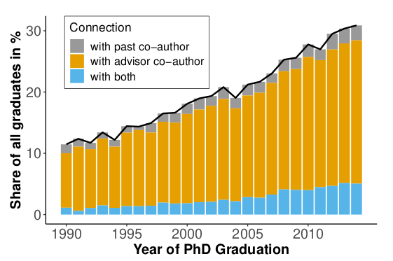

---

##### Download:

- [Paper](network-hiring.pdf)
- [Online appendix](network-hiring-appendix.pdf)
- [Code for data pipeline](https://github.com/f-hafner/mag_sample)

---

##### Abstract:

We study the role of collaboration networks in the labor market for young scientists in the United States. Nearly one in five PhD graduates publish after graduation at universities where their advisor has a co-author; such pre-existing connections more than double the probability of matching with the university---even within fine-grained peer groups. The importance of the advisor’s network for placement doubled from 1990 to 2014. For graduates placed via the advisor's network, we document a citation premium of 9 to 30 percent but find no evidence of private information being revealed.


---

##### Figure 1a: Share of PhD graduates placed within collaboration network



<!-- ---

##### Citation

Author 1, Author 2. Year. "Title." *Journal* Volume (Issue): First page–Last page. https://doi.org/paper_doi.

```BibTeX
@article{AAYY,
author = {Author 1 and Author 2},
doi = {paper_doi},
journal = {Journal},
number = {Issue},
pages = {XXX--YYY},
title = {Title},
volume = {Volume},
year = {Year}}
``` -->

---

##### Related material

+ [Presentation slides](https://doi.org/10.5281/zenodo.10071496)